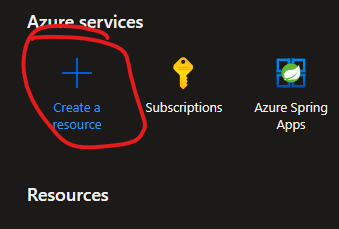

# Setting Supabase On An Azure Ubuntu Vm With a reverse proxy
## Azure Vm 
1. Sign into your azure portal. From the home page create a resource group by hitting the create resource button in the top left. 

1. 
1. 
 
## Setup Vm 