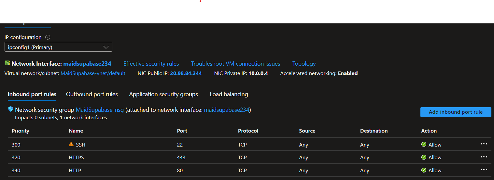
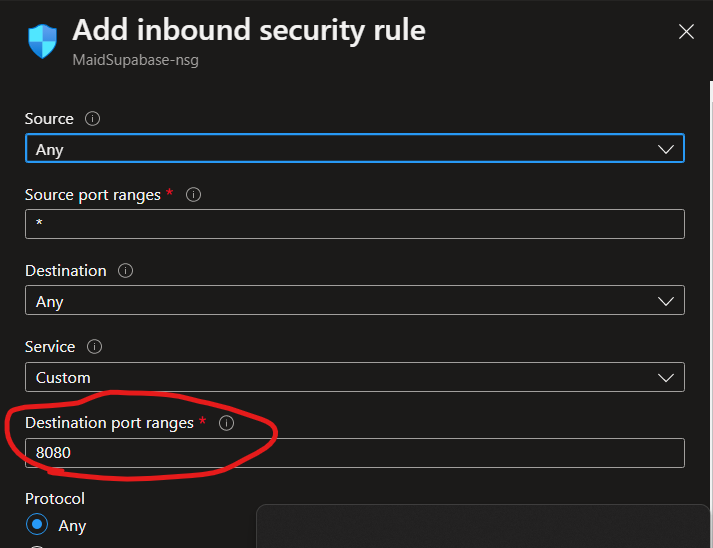

# Setting Supabase On An Azure Ubuntu Vm With A Reverse Proxy.
# Azure Vm.
## Making The Resource Group.
1. Sign into your azure portal. From the home page create a resource group by hitting the create resource button in the top left. 
1. Once you are in the Create Resource page use the search function and look up Resource Group. Once you have searched this there will be an option that says resource group. Click the create button and hit Resource Group. 
1. It will take you through the work flow of setting up the resource group. If you don't know what to name the group or what supscription or region to put it under/in talk to your team to figure out what subscription you can use and if the region of the group matter. The name of the resource group doesn't really matter as long as it is unique in the organization. You won't need to add any tags for this group. Once the group is named and the subscription and region have been choose you can hit next until you make it to the create page and then hit create.
1. Once the Resource Group is created you should be able to find it on the home page.
## Making The Ubuntu Vm
1. We need to make a new resource, but this time we will be making a ubuntu virtual machine instead of a resource group. This will be the same as steps one and two from the Making The Resource Group section above. However, instead of searching resource group in step two you will search virtual machine. Click the create button and then hit virtual machine. This will take you to a similiar work flow as the one for making the resource group. 
1. Once you are inside the work flow under the basics tab you will need to configure the options listed below. 
    - Subscription: This should be the same subscritption as the resource group you made earlier. 
    - Resource Group: This should be the resource group made earlier. 
    - Name: Make a name for your machine. It won't really matter what you call it but make sure it is named so that it can be identified easily later. 
    - Region: Like the resource group the region shouldn't really mattter. If your team doesn't tell you make it the same as the resource group or try and select the region closest to you. 
    - Image: You can choose any image you want as long as it is an Ubuntu Server 20.04 image.
    - Size: This will determine how much machine you get and is the largest factor in determining cost. For our purposes we won't need anything greater then 2 vcpus, and 8GiB memory.
    - Authentication type: Toggle this one to password
    - Username: This will be the username that we will use to log into the machine. Make sure it is secure but something you won't forget.
    - Password/Confirm Password: These will be the password that we will use to sign into the the virtual machine from a remote host. Do Not Forget Them!
    - Public Inbound Ports: We will have this toggled to allow selected ports
    - Select Inbound Ports: For now we will only need port 22 selected. We will be able to expose other ports to the machine once it is up later. 
1. Once you have configured the basics tab you can click the networking tab and there are only two thing we need to configure here. 
    - Virtual Network: If there isn't already one made hit create new under the drop down box and give the v-net a meaningful name and hit create. 
    - Subnet: If you just made the network this should autofill for you. If not using the default supnet should be fine. Check with your team to make sure that the default will be fine for this machine. 
1. After that go to the Review+create tab and it will make sure all the required configuration is there. Once it is done checking and if there aren't any error hit create.

## Exposing Ports And Making A DNS For The Machine
1. After the machine is made you can go to it's resource group and should see something similiar to this. 

Azure made your virtual machine, in this case MaidSupabase, and all the supporting resources for it. 
1. Click on your machine and it will take you to an overview page. On the left side you will see a lot of different views where we can configure different elements of the machine. First we want to give our machine a DNS. We can find this in the overview page if it doesn't have one it will have a place under neither DNS name to click to make one. 
You can see the public Ip address here along with the DNS name. This machine already had it's name configured. If it isn't configured hit the option under the DNS name and it will take you and ask you to provide a name. 
When you type in the name it will tell you if it is valid or not. Once you have a valid name go back the resource group and your machine to see the DNS name field has been changed. 

# Setting Up The Vm 
- For this next part we will be using Visual Studio Code remote connection to connect to our machine. If you don't have Visual Studio Code on the machine(Not the virtual machine but your own) Than go [here](https://code.visualstudio.com/download) and download it to your local machine. Once visual studio is installed you can continue to the next steps 
## Connecting To Remote Machine
1. Open VS Code and download the extension Remote - SSh from Microsoft.  This will allow use to remotely connect to machines and edit files on that machine using VS Code.
1. After the extension is downloaded. Look in the bottom left and there should be a symbol that looks similiar to this . Click this symbol and a selection will drop down and click __connect to host__.
1. Now you are going to click add new ssh host. It will ask you to enter the username that you are going to login to the machine with and a route to the machine. You need to do it in this format {Username}@{TargetMachine}. The username is the one the you entered in the Making an Ubuntu Vm step. The Target Machine is going to be the ip address that is in the overview page of the machine.
1. It will then ask you if you want to add it to a configuration file to make connecting to this machine easier in the future. Select the path that is C:\Users\\{yourUser}\\.ssh\\config this will save it for later. Now if you hit that symbol again and select connect to host your config should show up with just the ip address of you machine. 
1. Now click that host and it will open a new visual studio window where you will be prompted to enter the password for the user that you told the machine you wanted to connect with when making the host. This should be the password that you enter in the Making An Ubuntu Vm step. Enter the password and connect. If it is successful you will connected to the remote machine. 
1. You can now click the terminal button at the top of your VS Code window to open a remote terminal in that machine. The machine is a clean slate with only the default ubuntu setup. 
### Getting Needed Tool On The Remote Machine.
- List of Tools 
    - git
    - Docker and Docker Compose
    - LazyDocker (Optional)
    - Apache Password Authentication
## git
- The ubuntu distribution should come with git already installed, but you can check by running.
  ```
  git --version 
  ```
    This will tell you the current version of git. If the command fails follow the instructions [here](https://www.digitalocean.com/community/tutorials/how-to-set-up-password-authentication-with-apache-on-ubuntu-18-04-quickstart) to install git for linuxs.
## Docker 
- First check if docker is already installed by running 
    ```
    docker version
    ```
    If it isn't installed follow steps 1 and 2 in [this guide](https://www.digitalocean.com/community/tutorials/how-to-install-and-use-docker-on-ubuntu-20-04#step-1-installing-docker).
    once it is installed move to the next step. 
## Docker-Compose
- This will allow us to build our supabase docker compose project. To install this tool follow along with step one in [this guide](https://www.digitalocean.com/community/tutorials/how-to-install-and-use-docker-compose-on-ubuntu-20-04#step-1-installing-docker-compose). If you want an overview of what compose can do you can read the rest of that article but it is optional. 

## Exposing Ports On Azure. 
- Now that the machine is ready for the next steps we will need ports 80 and 443 to be opened on the azure firewall. Go to your VM on azure and on the left side there is a networking tab. Click that and you should see something similiar to this. 

We are going to be adding inbound port rules for https and http. 
- Click the Add Inbound Port Rule on the right of the page and fill in the Destination port with the desired port. We are going to make two rules one for http(port 80) and https(port 443) and 3000(The studio port). 
- Once you see that rule show up in the list of rules you are ready to move on. 

## Clone The Repo
- Next you just need to run this command to clone the supabase repo. 
    ```
    git clone https://github.com/garv5014/maidServiceSupabase.git     
    ```
    If you run into permission issues talk to your team to get the need permission for the repo. 
## Build the project 
- All you need to do now is navigate to the Docker folder in the repo and run ```docker-compose up -d``` this will build the docker container that has a swag reverse proxy infront of it. We need to change a few files to match your DNS that you gave you machine but we will do that in the next step.
- You can runn the command ```lazydocker``` to see the containers running and there logs.  
## Updating Environment For Your Machine. 
- In the docker folder run ``` docker-compose down -v ``` to stop the project running. We are going to be altering a few of the files in this repo to match your machine. To make altering the files easier we want them to show up in VS code. Run ``` code . ``` in the terminal from inside the Docker directory and it will make a new VS Code window that will prompt you to login again. After logging in you should be able to see the folder and files in the folder view on the left side. 
### Editing files. 
1. __.env file__: There will be a .env file in the Docker folder. You will need to change the values in this file as follows 
    - SITE_URL =http://{TheIpAddressOfYourMachine}:3000
    - API_EXTERNAL_URL=http://{TheIpAddressOfYourMachine}:8000
    -SUPABASE_PUBLIC_URL=http://{TheIpAddressOfYourMachine}:8000 
1. __Docker Compose__: There is dockerCompose.yml in the Docker directory that we will be changing next. Open this file and look for the reverse-proxy project should look similiar to this. 
    ```yml
    reverse-proxy:
    image: ghcr.io/linuxserver/swag
    container_name: reverse-proxy
    restart: unless-stopped
    environment:
        - PUID=1000
        - PGID=1000
        # - TZ=America/Denver
        - URL={TheMachinesDNS} # change this one
    # - SUBDOMAINS=wildcard
        - VALIDATION=http
        - STAGING=false
    # - VALIDATION=dns
    # - DNSPLUGIN=cloudflare
    volumes:
        - ./volumes/db/default.conf:/config/nginx/site-confs/default.conf
        - /data/swag:/config
    ports:
        - 0.0.0.0:80:80
        - 0.0.0.0:443:443
    ```
    We only need to change one value here and that is the URL Value with the DNS of the machine as shown above. 
1. __default.conf__: This file is located at Docker/volumes/db. We will only change one thing in this file in the server block
    ```nginx
    server {
    listen 443 ssl;
    server_name {YourMachineDNS};

    include /config/nginx/ssl.conf;
    include /config/nginx/proxy.conf;
    include /config/nginx/resolver.conf;

        ....
    }
    ```
    We need to make this have the servername as your DNS for the machine. This will be the same DNS you put in the dockercompose.yml file.
- Now we are ready to rebuild the compose file. First we will want to delete the data folder in the found at Docker/volumes/db. Once that is delete you can run ``` docker-compose up -d  ``` and make sure that everything is healthy with lazydocker. 

# Wrap Up 
You should now be able to hit your supabase studio on http://DNS:3000. You now have a supabase instance hosted on the virtual machine in the cloud.