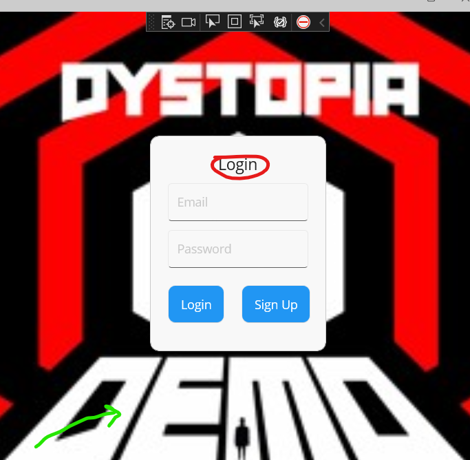
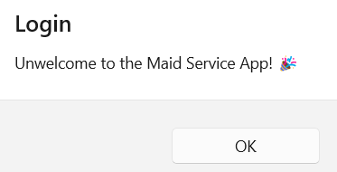
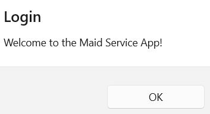
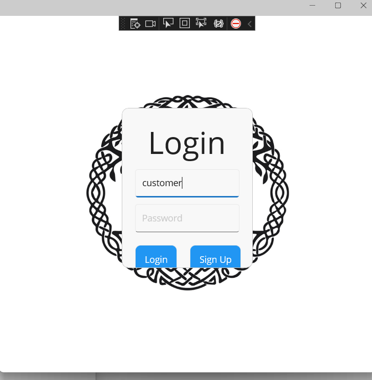

# Release
- Here is the workflow file that we are using to upload the releases. If you want to see the release and how many you can see them [here](https://github.com/garv5014/MaidService/releases)
```yml 
name: Release Workflow
on:
  push:
    tags:
      - 'v*.*.*'
jobs:
  begin-release:
    runs-on: ubuntu-latest
    outputs:
      upload_url: ${{ steps.create_release.outputs.upload_url }}
    steps:
    - name: create-release
      uses: actions/create-release@v1
      id: create_release
      with:
        draft: false
        prerelease: false
        release_name: Release windows ${{ github.ref }}
        tag_name: ${{ github.ref }}
      env:
        GITHUB_TOKEN: ${{ github.token }}
 
  build-windows:
    runs-on: windows-2022
    permissions: write-all
    name: Windows Build
    needs: begin-release
    steps:
      - name: Checkout
        uses: actions/checkout@v3
      - name: Setup .NET 7
        uses: actions/setup-dotnet@v1
        with:
          dotnet-version: 7.0.x
          include-prerelease: true
      - name: Setup MSBuild
        uses: microsoft/setup-msbuild@v1.1
        with:
          vs-prerelease: true
      - name: Install MAUI Workloads
        run: |
          dotnet workload install maui --ignore-failed-sources
      - name: Restore Dependencies
        run: dotnet restore ./MaidService/MaidService.csproj
      - name: Build MAUI Windows
        run: msbuild .\MaidService\MaidService.csproj /restore /t:build /p:TargetFramework=net7.0-windows10.0.19041.0 /p:configuration=release /p:WindowsAppSDKSelfContained=true /p:Platform=x64 /p:WindowsPackageType=None /p:RuntimeIdentifier=win10-x64
    
      - name: zip_file
        run: |
          Compress-Archive -Path ./MaidService/bin/x64/release/net7.0-windows10.0.19041.0/win10-x64 -DestinationPath ./windows.zip
      - name: upload windows artifact-release
        uses: actions/upload-release-asset@v1
        env:
          GITHUB_TOKEN: ${{ github.token }}
        with:
          upload_url: ${{ needs.begin-release.outputs.upload_url }}
          asset_path: ./windows.zip
          asset_name: windows_app.zip
          asset_content_type: application/zip
      
  # got from https://blog.taranissoftware.com/building-net-maui-apps-with-github-actions#heading-android-build-job
  build-android:
    runs-on: windows-2022
    permissions: write-all
    needs: begin-release
    name: Android Build
    steps:
      - name: Checkout
        uses: actions/checkout@v3
      - name: Setup .NET 7
        uses: actions/setup-dotnet@v1
        with:
          dotnet-version: 7.0.x
          include-prerelease: true
      - uses: actions/setup-java@v2
        with:
          distribution: 'microsoft'
          java-version: '11'
      - name: Install MAUI Workloads
        run: |
          #dotnet workload install android --ignore-failed-sources
          dotnet workload install maui --ignore-failed-sources
      - name: Restore Dependencies
        run: dotnet restore ./MaidService/MaidService.csproj
      - name: Build MAUI Android
        run: dotnet build ./MaidService/MaidService.csproj -c Release -f net7.0-android --no-restore
      - name: upload android artifact-release
        uses: actions/upload-release-asset@v1
        env:
          GITHUB_TOKEN: ${{ github.token }}
        with:
          upload_url: ${{ needs.begin-release.outputs.upload_url }}
          asset_path: ./MaidService/bin/Release/net7.0-android/com.companyname.maidservice-Signed.apk
          asset_name: MaidService.apk
          asset_content_type: application/zip
```
# API 

## Client Side
- Client side for demonstration purposes we are making two clients that both hit different versions of the api in the MauiProgram.cs. The controller will be able to tell what endpoint to use based on the header that we pass in. That header is being made and added to the different clients we make below. 
```C#
  ...
builder.Services.AddHttpClient("v1", c =>
{
    //localhost:7203
    c.BaseAddress = new Uri("https://localhost:7203/");
    c.DefaultRequestHeaders.Add("version", "1.0");
}).ConfigurePrimaryHttpMessageHandler(() => new HttpClientHandler());

builder.Services.AddHttpClient("v2", c =>
{
    c.BaseAddress = new Uri("https://localhost:7203/");
    c.DefaultRequestHeaders.Add("version", "2.0");
}).ConfigurePrimaryHttpMessageHandler(() => new HttpClientHandler());
  ...
```
- We make a ApiService where we can comment in and out the different versions of the api to make it easier to present. 
```C# 
  ...
// Service/ApiService
private readonly HttpClient version1;
private readonly HttpClient version2;

public ApiService(HttpClient v1, HttpClient v2)
{
    version1 = v1;
    version2 = v2;
}

// gets a login message from the api
public async Task<string> GetLoginMessage()
{
    //var res = version1.GetFromJsonAsync<string>("api/MaidService/LoginPage/Message");
    var res = await version2.GetAsync("api/MaidService/LoginPage/Message");
    return await res.Content.ReadAsStringAsync();
}

//gets an image from the api
public async Task<string> GetImageUrl()
{
    var result = await version1.GetAsync("api/MaidService/Logo");
    //var result = await version2.GetAsync("api/MaidService/Logo");
    return await result.Content.ReadAsStringAsync();
}

// Gets a font size from the api
public async Task<int> GetFontSize()
{
    var result = await version1.GetAsync("api/MaidService/LoginPage/FontSize");
    //var result = await version2.GetAsync("api/MaidService/LoginPage/FontSize");
    return await result.Content.ReadFromJsonAsync<int>();
}
```

You can see that two of the functions are hitting version one and one function is hitting version two. 

## API Side
- We want are endpoints for be able to distiguish between the request based on the header. To do this we needed to make a HttpHeaderAttribute class that inherits from the Attribute class and the IActionConstraint interface. 
```C#
//Controllers/HttpHeaderAttribute.cs
public class HttpHeaderAttribute : Attribute, IActionConstraint
{
    public string Header { get; set; }
    public string Value { get; set; }

    public HttpHeaderAttribute(string header, string value)
    {
        Header = header;
        Value = value;
    }

    public bool Accept(ActionConstraintContext context)
    {
        if (context.RouteContext.HttpContext.Request.Headers.TryGetValue(Header, out var value))
        {
            return value[0] == Value;
        }

        return false;
    }

    public int Order => 0;
}
```
Using this class we can have endpoints with the same routes but different headers that look like this. 
```C#
//Controllers/MaidServiceController.cs
[HttpGet("LoginPage/Message"), HttpHeader("version" , "1.0" )]
public async Task<string> GetLoginMessageV1()
{
    var res = await Task.FromResult("Welcome to the Maid Service App!");
    return res;
}

[HttpGet("LoginPage/Message"), HttpHeader("version", "2.0")]
public async Task<string> GetLoginMessageV2()
{
    var res = await Task.Run(() => "Unwelcome to the Maid Service App! 🎉");
    return res;
}
...
```
Now when a request is made to the api at /LoginPage/Message it will look at the header of the request and if the version is 1.0 it will hit the top on and if it is 2.0 the bottom one. 

# Proof 
- Here is the loginPage plus the pop up response with the client service configured as so. 
```C#
public async Task<string> GetLoginMessage()
{
    //var res = version1.GetFromJsonAsync<string>("api/MaidService/LoginPage/Message");
    var res = await version2.GetAsync("api/MaidService/LoginPage/Message");
    return await res.Content.ReadAsStringAsync();
}

public async Task<string> GetImageUrl()
{
    var result = await version1.GetAsync("api/MaidService/Logo");
    //var result = await version2.GetAsync("api/MaidService/Logo");
    return await result.Content.ReadAsStringAsync();
}

public async Task<int> GetFontSize()
{
    var result = await version1.GetAsync("api/MaidService/LoginPage/FontSize");
    //var result = await version2.GetAsync("api/MaidService/LoginPage/FontSize");
    return await result.Content.ReadFromJsonAsync<int>();
}
```
- The login screen has the Dystopia background and the LOGIN text is normal. When you login you are greeted with an unwelcome message. 


- When we change what version are being used in the apisevice to this
```C# 
public async Task<string> GetLoginMessage()
{
    var res = await version1.GetAsync("api/MaidService/LoginPage/Message");
    //var res = await version2.GetAsync("api/MaidService/LoginPage/Message");
    return await res.Content.ReadAsStringAsync();
}

public async Task<string> GetImageUrl()
{
    //var result = await version1.GetAsync("api/MaidService/Logo");
    var result = await version2.GetAsync("api/MaidService/Logo");
    return await result.Content.ReadAsStringAsync();
}

public async Task<int> GetFontSize()
{
    //var result = await version1.GetAsync("api/MaidService/LoginPage/FontSize");
    var result = await version2.GetAsync("api/MaidService/LoginPage/FontSize");
    return await result.Content.ReadFromJsonAsync<int>();
}
```
The Login page and message change to a different photo and larger font for the LOGIN, while the messge changes to a welcome message.

