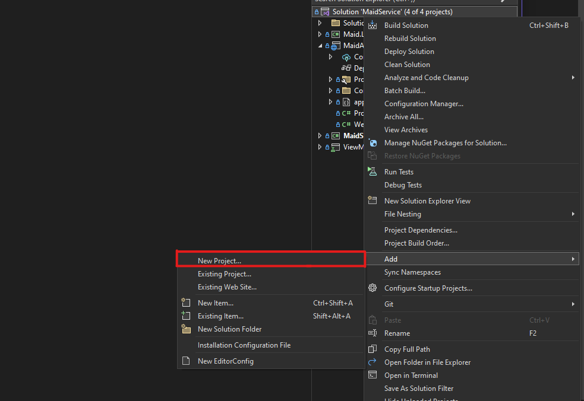
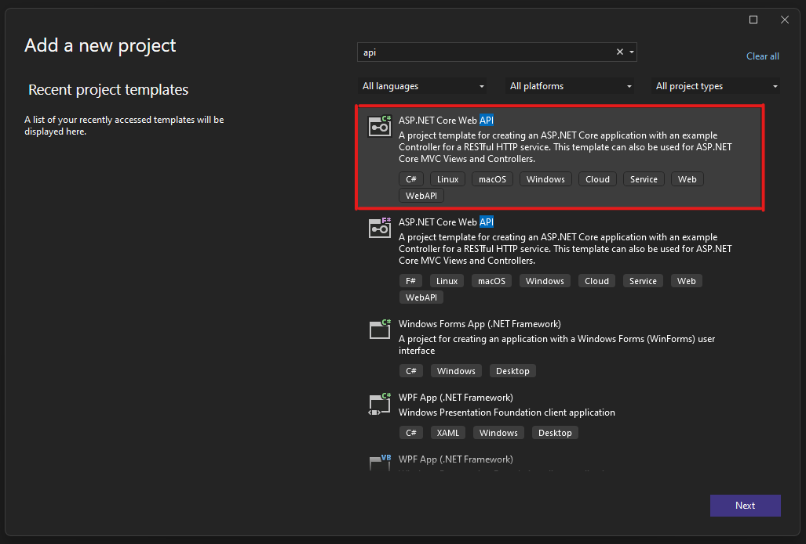
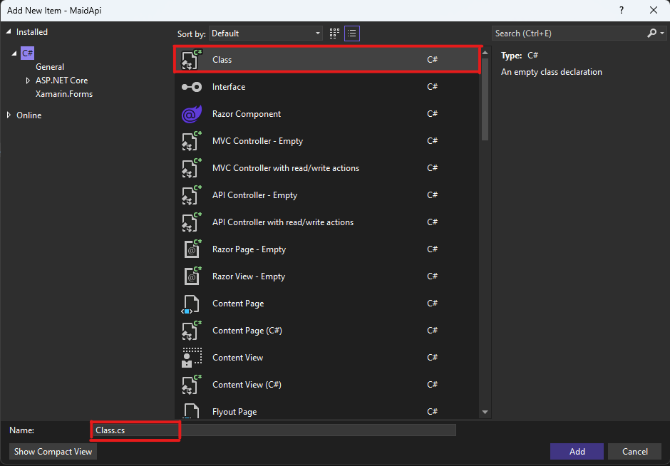

# Setting up API Versioning from Scratch
This is a documented process of how to set up API versioning for a C# project using Visual Studio 2022. For this demonstration, Visual Studio must be up and running with the solution you wish to modify.

## Requirements
- [Install Visual Studio](https://visualstudio.microsoft.com/downloads/)
- Create/Open a solution that you want to modify

&nbsp;

## Create API Project
1. Navigate to **Solution Explorer --> Add --> New Project...**

    

&nbsp;

2. In the new window, select the "ASP.NET Core Web API" template. If you don't see immediately, you can search for it in the searchbar located just above.

    

&nbsp;

3. Name your project and select the file location under the **Project Name** and **Location** headers. Press **Next** at the bottom-right corner of the window.
4. Ensure the **Framework** selected is the one you want and click **Create**.

At this point, you should have a new project in the sidebar with the name you provided for **Project Name**.

## Create HTTP Header Attribute
1. Similar to the previous step (refer to **Create API Project**), right-click on the *Controllers* Folder under your new API project and select **Add --> New Item...**
2. A window with a list of templates should appear. Locate the class template and name it "HttpHeaderAttribute" at the bottom, then click **Add**.
    - Hint: If a window appears but is different to what is shown then select **Show All Templates** at the bottom-left corner.

    

3. Inside the *HttpHeaderAttribute.cs* file, you will write this code.
    ### **HttpHeaderAttribute.cs**
    ```C#
    using Microsoft.AspNetCore.Mvc.ActionConstraints;

    namespace MaidApi.Controllers;

    public class HttpHeaderAttribute : Attribute, IActionConstraint
    {
        public string Header { get; set; }
        public string Value { get; set; }

        public HttpHeaderAttribute(string header, string value)
        {
            Header = header;
            Value = value;
        }

        public bool Accept(ActionConstraintContext context)
        {
            if (context.RouteContext.HttpContext.Request.Headers.TryGetValue(Header, out var value))
            {
                return value[0] == Value;
            }

            return false;
        }

        public int Order => 0;
    }
    ```

## Create HTTP Clients
Inside of the *program.cs* file for the main project of your solution (**NOT** your API project), you will enter this code towards the top of the file. Our project is a .NET Maui project so ours will be named *MauiProgram.cs* instead.

### **MauiProgram.cs**
```C#
builder.Services.AddHttpClient("v1", c =>
{
    c.BaseAddress = new Uri("https://maidapi20230425203237.azurewebsites.net/");
    c.DefaultRequestHeaders.Add("version", "1.0");
}).ConfigurePrimaryHttpMessageHandler(() => new HttpClientHandler());

builder.Services.AddHttpClient("v2", c =>
{
    c.BaseAddress = new Uri("https://maidapi20230425203237.azurewebsites.net/");
    c.DefaultRequestHeaders.Add("version", "2.0");
}).ConfigurePrimaryHttpMessageHandler(() => new HttpClientHandler());

builder.Services.AddSingleton<IApiService>(provider =>
{
    var clientV1 = provider.GetRequiredService<IHttpClientFactory>().CreateClient("v1");
    var clientV2 = provider.GetRequiredService<IHttpClientFactory>().CreateClient("v2");

    return new ApiService(clientV1, clientV2);
});
```