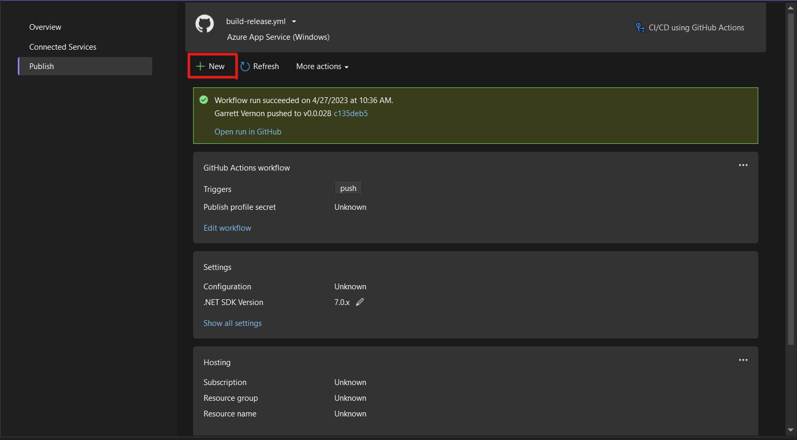

# Setting up API Versioning from Scratch
This is a documented process of how to set up API versioning for a C# project using Visual Studio 2022. For this demonstration, Visual Studio must be up and running with the solution you wish to modify.

## Requirements
- [Install Visual Studio](https://visualstudio.microsoft.com/downloads/)
- Create/Open a solution that you want to modify

&nbsp;

## Create API Project
1. Navigate to **Solution Explorer --> Add --> New Project...**

    

&nbsp;

2. In the new window, select the "ASP.NET Core Web API" template. If you don't see immediately, you can search for it in the searchbar located just above.

    

&nbsp;

3. Name your project and select the file location under the **Project Name** and **Location** headers. Press **Next** at the bottom-right corner of the window.
4. Ensure the **Framework** selected is the one you want and click **Create**.

At this point, you should have a new project in the sidebar with the name you provided for **Project Name**.

## Create HTTP Header Attribute
1. Similar to the previous step (refer to **Create API Project**), right-click on the *Controllers* Folder under your new API project and select **Add --> New Item...**
2. A window with a list of templates should appear. Locate the class template and name it "HttpHeaderAttribute" at the bottom, then click **Add**.
    - Hint: If a window appears but is different to what is shown then select **Show All Templates** at the bottom-left corner.

    

3. Inside the *HttpHeaderAttribute.cs* file, you will write this code.
    ### **HttpHeaderAttribute.cs**
    ```C#
    using Microsoft.AspNetCore.Mvc.ActionConstraints;

    namespace MaidApi.Controllers;

    public class HttpHeaderAttribute : Attribute, IActionConstraint
    {
        public string Header { get; set; }
        public string Value { get; set; }

        public HttpHeaderAttribute(string header, string value)
        {
            Header = header;
            Value = value;
        }

        public bool Accept(ActionConstraintContext context)
        {
            if (context.RouteContext.HttpContext.Request.Headers.TryGetValue(Header, out var value))
            {
                return value[0] == Value;
            }

            return false;
        }

        public int Order => 0;
    }
    ```

## Create API Interface, API Class, & Controller
### API Interface
Navigate to your main project.

1. Right-click on the project in **Solution Explorer** and select **Add --> New Item...**
2. Select the Interface template and name it. Then select **Add**.

Here is an example of our API interface:

#### **IApiService.cs**
```C#
public Task<string> GetLoginMessage();
public Task<string> GetImageUrl();
```

### API Class
3. Repeat Steps 1 & 2, but select the class template this time.

Here is an example of our API service class:

#### **ApiService.cs**
```C#
private readonly HttpClient version1;
private readonly HttpClient version2;

public ApiService(HttpClient v1, HttpClient v2)
{
    version1 = v1;
    version2 = v2;
}

public async Task<string> GetLoginMessage()
{
    //var res = version1.GetFromJsonAsync<string>("api/MaidService/LoginPage/Message");
    var res = await version2.GetAsync("api/MaidService/LoginPage/Message");
    return await res.Content.ReadAsStringAsync();
}
```

### Controller
Navigate back to your API project.

4. Repeat Steps 1 & 2, but select the controller template.

Here is an example of our controller:

#### **MaidServiceController.cs**
```C#
[HttpGet("LoginPage/Message"), HttpHeader("version" , "1.0" )]
public async Task<string> GetLoginMessageV1()
{
    var res = await Task.FromResult("Welcome to the Maid Service App!");
    return res;
}

[HttpGet("LoginPage/Message"), HttpHeader("version", "2.0")]
public async Task<string> GetLoginMessageV2()
{
    var res = await Task.Run(() => "Unwelcome to the Maid Service App! 🎉");
    return res;
}
```

At this point, ensure your projects have the proper references in place.

&nbsp;

## Create HTTP Clients
Inside of the *program.cs* file for the main project of your solution (**NOT** your API project), you will enter this code towards the top of the file. Our project is a .NET Maui project so ours will be named *MauiProgram.cs* instead.

### **MauiProgram.cs**
```C#
builder.Services.AddHttpClient("v1", c =>
{
    c.BaseAddress = new Uri("https://maidapi20230425203237.azurewebsites.net/");
    c.DefaultRequestHeaders.Add("version", "1.0");
}).ConfigurePrimaryHttpMessageHandler(() => new HttpClientHandler());

builder.Services.AddHttpClient("v2", c =>
{
    c.BaseAddress = new Uri("https://maidapi20230425203237.azurewebsites.net/");
    c.DefaultRequestHeaders.Add("version", "2.0");
}).ConfigurePrimaryHttpMessageHandler(() => new HttpClientHandler());

builder.Services.AddSingleton<IApiService>(provider =>
{
    var clientV1 = provider.GetRequiredService<IHttpClientFactory>().CreateClient("v1");
    var clientV2 = provider.GetRequiredService<IHttpClientFactory>().CreateClient("v2");

    return new ApiService(clientV1, clientV2);
});
```

In the first five lines of the code, we are creating the first HTTP client. The `BaseAddress` property will either be an external link to your API or your localhost with a specific port if the API is on your machine (eg. http[]()://localhost:1234). `DefaultRequestHeaders.Add()` takes in the name of the header as the first argument and the value of the header as the second argument as shown.

## Publish API Project
1. Right-click your API project and select **Publish**.
2. In the top-left corner of the window, select **New**.

    

3. A new window will appear with a list of targets to deploy to. Select **Azure --> Azure App Service (Linux)** (You are not required to choose Azure App Service, that is just what was chosen for this project.)
4. Next create a new instance to deploy your API to. *Disclaimer: You may be prompted to login/sign up to Azure.*
5. In the API Management tab, select the checkbox in the bottom-left corner labeled "Skip this step" and press **Next**.
6. Now select *CI/CD using GitHub Actions workflows* and press **Finish**.
7. Finally, push your project to GitHub.